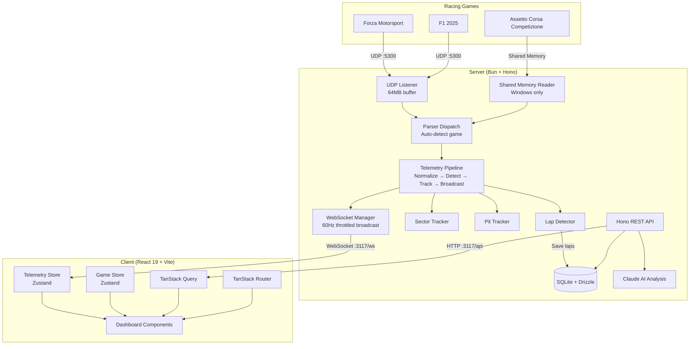
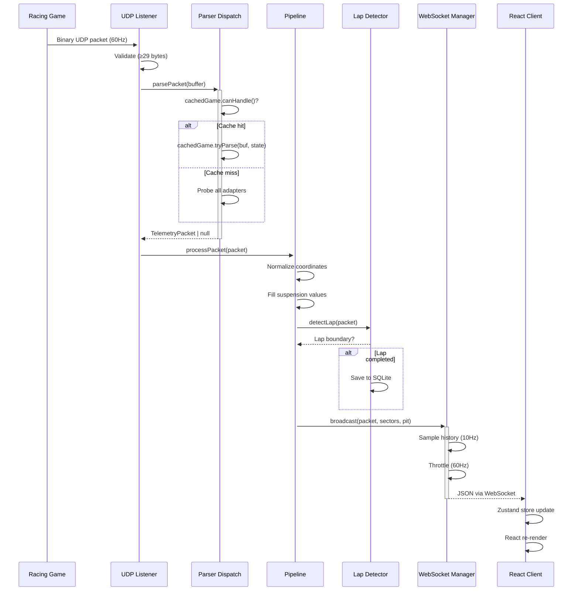
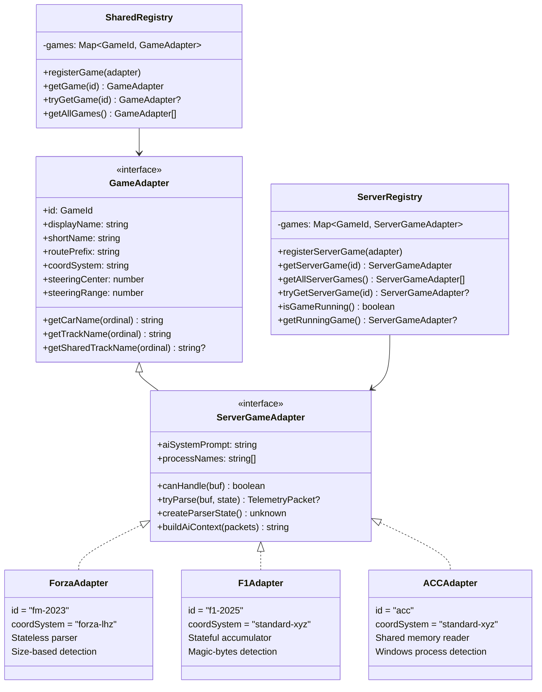
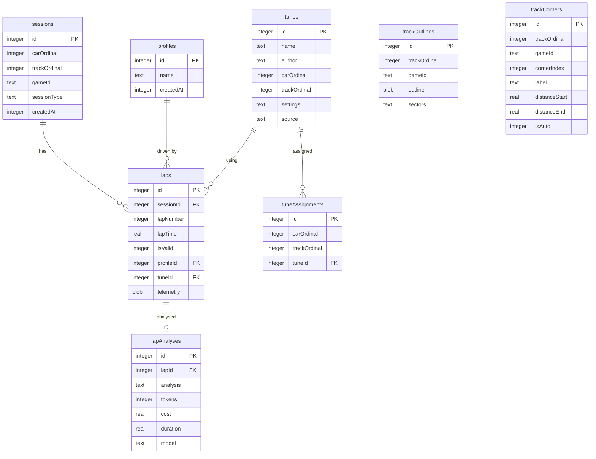
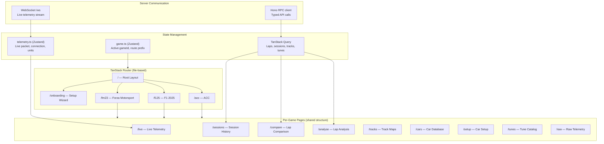
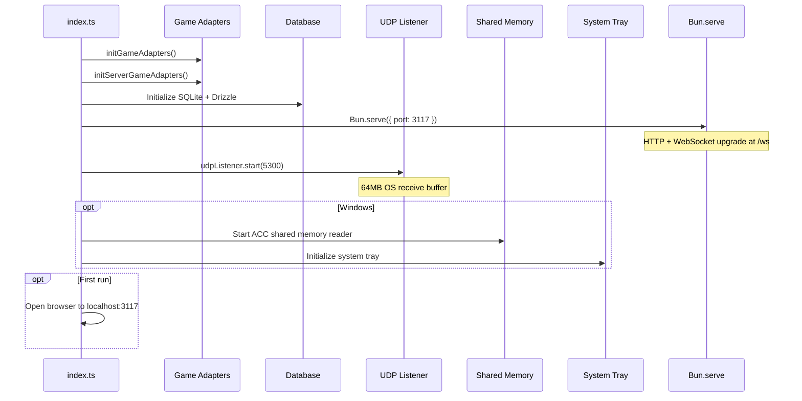
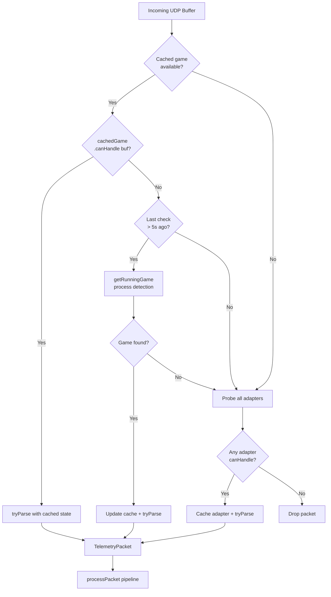

# RaceIQ Architecture

Visual architecture diagrams for the RaceIQ racing telemetry platform.

## System Overview

## Telemetry Data Flow

## Game Adapter Pattern

## Database Schema

## Client Architecture

## Server Startup Sequence

## Parser Dispatch Strategy

